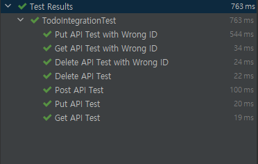
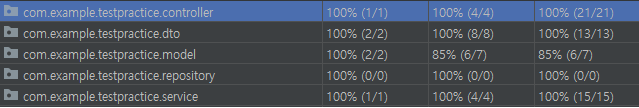

# 프로그램 목적
JUnit을 이용한 테스트 케이스 작성 연습을 위한 서버입니다.

# 프로그램 실행 및 테스트 환경
Java 8

Spring Boot 2.6.1

# 테스트

## Integration Test

[IntegrationTest.java](./src\test\java\com\example\testpractice\TestpracticeApplicationTests.java)

통합테스트를 수행한 결과입니다.

테스트 커버리지 결과입니다.

## Slice Test

### WebMvcTest

[ControllerSliceTest](./src\test\java\com\example\testpractice\controller\ControllerSliceTest.java)

### DataJPATest

[TodoRepositoryTest](./src\test\java\com\example\testpractice\repository\TodoRepositoryTest.java)

